# Gradle Conventions

Conventional Gradle plugins. The ones named with `bundle` are intended to each fulfill a general use case and the others are smaller features that make up those use cases.

See documentation [in the code](/src/main/groovy) and also [running examples](/examples).

Release with `./gradlew updateVersion && ./gradlew release`.

It is published to: https://github.com/Forsakringskassan/repository

Use these plugins like this:

```groovy
buildscript {
  repositories {
    gradlePluginPortal()
    mavenCentral()
    mavenLocal()
    maven {
      url = uri("https://maven.pkg.github.com/Forsakringskassan/repository")
      credentials {
        username = project.findProperty("GITHUB_ACTOR") ?: System.getenv("PACKAGES_RW_ACTOR")
        password = project.findProperty("GITHUB_TOKEN") ?: System.getenv("PACKAGES_RW_TOKEN")
      }
    }
  }

  dependencies {
    classpath "se.fk.gradle:gradle-conventions:X"
  }
}

apply plugin: "se.fk.gradle.[name-of-plugin]"
```

## Setup

This library is published here on GitHub. To use it you need credentials setup.

- Go to <https://github.com/settings/tokens>
- You only need `read:packages`
- Add the credentials in `~/.gradle/gradle.properties`:
  - `GITHUB_TOKEN=the-token`
  - `GITHUB_ACTOR=your-github-user`

## `se.fk.gradle.bundle-jar`

The `se.fk.gradle.bundle-jar` is intended to fulfill most use cases. It might be a library or an application.

See example in [template-jar](https://github.com/Forsakringskassan/template-jar).

## `se.fk.gradle.bundle-openapi`

Applied in root for API repositories, to prodouce a JAR containing the specification. So that it can be published to a repository and used for code generation on the consumer side.

See example in [template-api](https://github.com/Forsakringskassan/template-api).

A client might be created by generating a `jaxrs-spec` and use that with (jaxrs-client-factory)[https://github.com/Forsakringskassan/jaxrs-client-factory].

```mermaid
flowchart TB
    %% Define nodes with better structure
    openapi["📄 OpenAPI<br/>Specification"]:::spec
    
    %% Build artifacts
    npm["📦 NPM Package<br/><small>TypeScript Client + Mocks</small>"]:::npm
    jar["☕ JAR Package<br/><small>OpenAPI Spec Bundle</small>"]:::jar
    
    %% Repository
    repo[("🏛️ Repository<br/><small>Maven / NPM</small>")]:::repo
    
    %% Build flow
    openapi -.->|"🔨 gradle build"| jar
    openapi -.->|"⚙️ npm build"| npm
    
    %% Publish flow
    jar -->|"📤 publish"| repo
    npm -->|"📤 publish"| repo
    
    %% Styling
    classDef spec fill:#e1f5fe,stroke:#0277bd,stroke-width:3px,color:#000
    classDef npm fill:#f3e5f5,stroke:#7b1fa2,stroke-width:2px,color:#000
    classDef jar fill:#fff3e0,stroke:#ef6c00,stroke-width:2px,color:#000
    classDef repo fill:#e8f5e8,stroke:#2e7d32,stroke-width:3px,color:#000
```



## `se.fk.gradle.openapi-generate`

Can be applied whenever you need code generated from a JAR produced by `se.fk.gradle.bundle-openapi`.

See example in [template-jar-api-generate](https://github.com/Forsakringskassan/template-jar-api-generate)

```mermaid
flowchart TB
    %% Repository
    repo[("🏛️ Repository<br/><small>Maven</small>")]:::repo
    
    %% Applications
    app1["🖥️ REST Application A<br/><small>Implements API</small>"]:::server
    app2["🖥️ REST Application B<br/><small>Consumes API</small>"]:::client

    %% Usage flow
    repo -->|"☕ OpenAPI Spec"| app1
    repo -->|"☕ OpenAPI Spec"| app2
    
    %% Integration flow
    app2 -.->|"🔗 HTTP API calls"| app1

    %% Styling
    classDef repo fill:#e8f5e8,stroke:#2e7d32,stroke-width:3px,color:#000
    classDef server fill:#fff8e1,stroke:#f57f17,stroke-width:2px,color:#000
    classDef client fill:#e3f2fd,stroke:#1976d2,stroke-width:2px,color:#000
```



